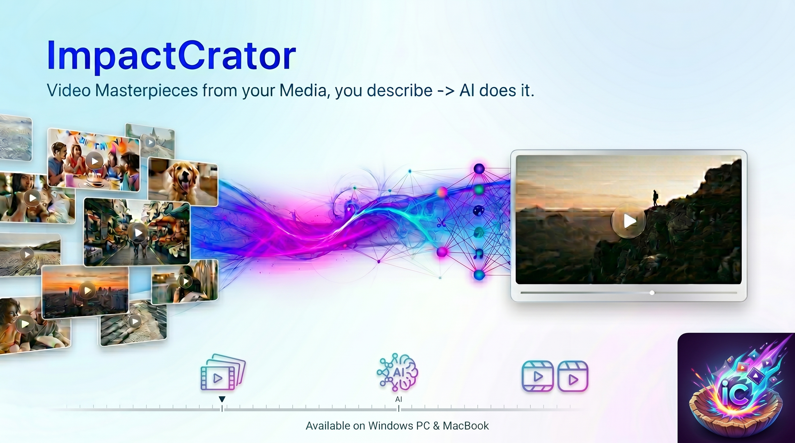
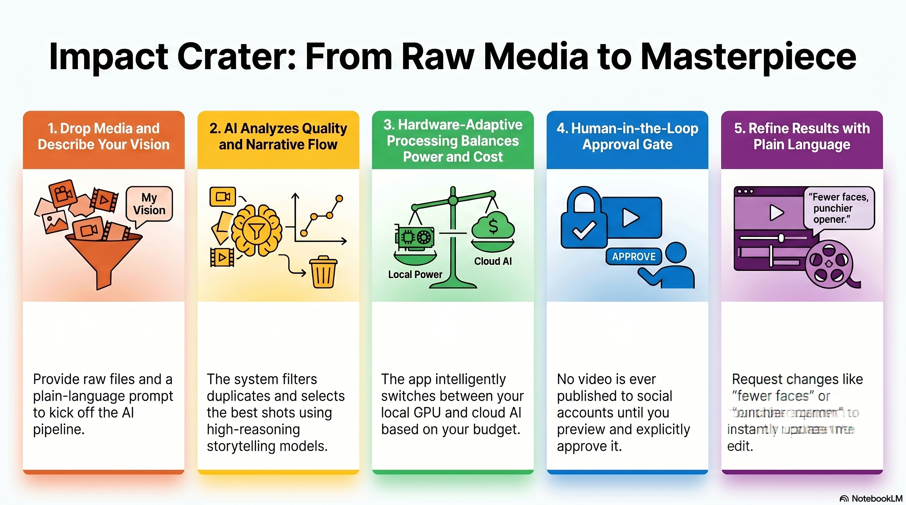
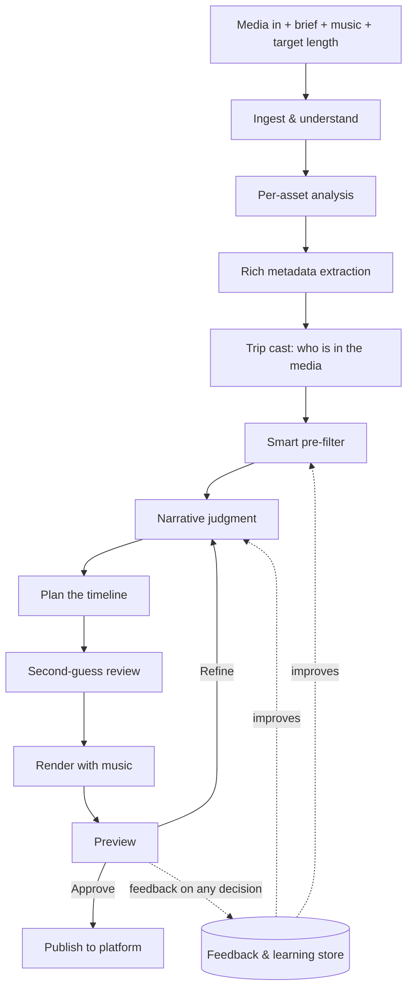
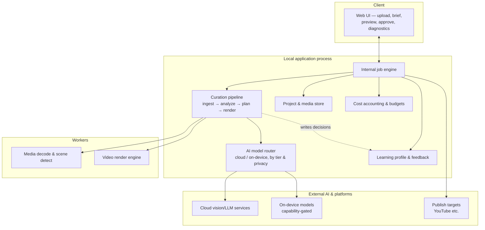
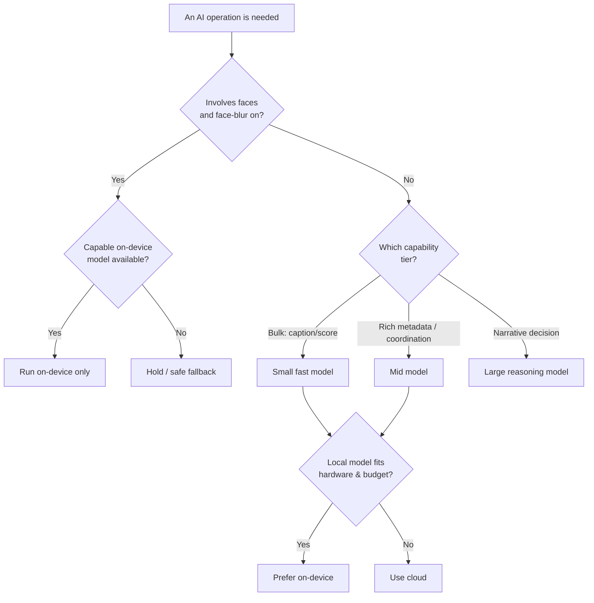
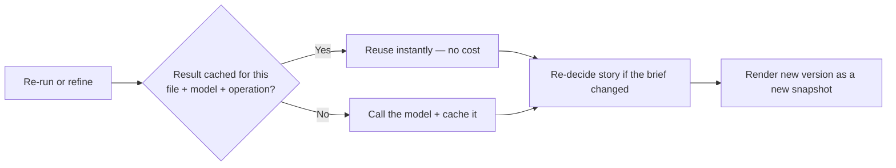

# Impact Crater — Product & Architecture Overview

[](https://notebooklm.google.com/notebook/d7db525d-d686-47d9-995b-211092185d03/artifact/39a9e5a9-eccb-4cd2-a52a-9d07423c4eb0?utm_source=nlm_web_share&utm_medium=google_oo&utm_campaign=art_share_1&utm_content=&utm_smc=nlm_web_share_google_oo_art_share_1_)

**[▶ Watch the video overview](https://notebooklm.google.com/notebook/d7db525d-d686-47d9-995b-211092185d03/artifact/39a9e5a9-eccb-4cd2-a52a-9d07423c4eb0?utm_source=nlm_web_share&utm_medium=google_oo&utm_campaign=art_share_1&utm_content=&utm_smc=nlm_web_share_google_oo_art_share_1_)**



> **What this document is.** A single, self-contained explanation of the whole
> application: what it does, what it produces, how it works end to end, the
> techniques behind it, its architecture and key flows, and where it is headed.
> It is written for a general audience — no internal tracking codes or
> shorthand — and is meant to be readable on its own (including by tools that
> generate presentations or summaries from it).
>
> **It is a consolidated mirror, not the working notes.** The team keeps
> detailed, fast-moving design notes elsewhere; this document is the stable,
> outward-facing summary and should be refreshed whenever the product's
> features, architecture, flows, or core design change.

---

## 1. What Impact Crater is

**Impact Crater turns a pile of your photos and videos into finished,
ready-to-share videos in one click.** You dump in a folder of raw media — often
thousands of photos and videos from a trip, event, or shoot — describe in your
own words what video(s) you want and which platform(s) to post to ("a one-minute
video of our Zion hike, building to the canyon overlook, scored to this song,
for YouTube"), click submit, and you're done. The AI does the rest — prepare,
plan, create, and (once you approve a preview) publish to your connected social
accounts. Under the hood it is a careful media curator, picking the best moments
and sequencing them into a narrative fitted to music — but to you it's one
action.

It also gets faster, cheaper, and more personal the more you use it: it learns
from your feedback, caches its analysis so it never re-examines the same photo
twice, adapts to your hardware and budget, and keeps a library of the people in
your trips — all in service of that single click, never as knobs you have to set.

It is **self-hosted first**: it runs as a local application on your own
machine, and it chooses between AI models running *on your hardware* and
*cloud AI services* at runtime, based on how capable your computer is and any
spending limits you set. A powerful workstation can do most of the work
locally; a lightweight laptop leans on the cloud. The same product can later
run as a hosted service without a rewrite.

### The core promise

> Drop in a folder of media, describe what you want in plain language, click
> submit, and come back to a finished, ready-to-share video — with a hard rule
> that nothing is published until you say so.

---

## 2. Who it's for, and the problem it solves

People come home from a trip or an event with hundreds or thousands of photos
and videos and **never make anything with them** — editing is tedious, picking
the best shots is overwhelming, and matching footage to music is a craft most
people don't have time to learn.

Impact Crater removes that friction. It does the selection, sequencing, music
matching, and rendering automatically, while keeping the person in control of
the final result. The target user is someone who wants beautiful, shareable
videos from their own media without spending hours in an editor.

---

## 3. Guiding principles

- **Self-hosted first.** Runs on your machine; your media stays with you by
  default. A hosted-service mode is a future configuration, not a different
  product.
- **Hardware-adaptive.** Automatically balances on-device AI and cloud AI based
  on your GPU/VRAM and your budget. Works on everything from a no-GPU laptop to
  a high-end workstation.
- **Preview, then approve — always.** The system never posts anything publicly
  without an explicit human approval step. This gate is fundamental.
- **Transparent.** Every decision is inspectable: what was kept, what was
  dropped and why, how the story was ordered, what each step cost.
- **Privacy-aware.** Location data and faces are handled with explicit, default-on
  protections, and sensitive operations can be kept on-device.
- **Cost-conscious.** Cheap, fast models do the bulk work; an expensive,
  high-reasoning model is used sparingly. Results are cached so re-runs are
  nearly free. You set hard spending limits up front.

---

## 4. What you can create

**Available today**

- **Story Video** — a single themed video built from your media with a
  background music track, rendered for landscape (16:9) viewing and publishable
  to YouTube. Two modes:
  - **Standard** — your music plays under a narrative cut of the best moments.
  - **Music-video** — the cuts are synchronized to the beat of your song, and
    you can describe which parts of the song should map to which kinds of footage
    ("the build-up over the climb, the chorus on the summit") in plain language.
  - **Optional title card** — you can opt in to an opening splash screen that
    captures the video's spirit: an AI-generated background with the trip's main
    people, a fitting title, and the year. If image generation isn't available it
    falls back to a clean typographic card, so it never blocks your video.
  - **Snappy, fully-covering pacing** — the cut favours many short moments
    (roughly two to three seconds each) over a few long-held photos, aims to touch
    every distinct place and time in the trip rather than dwelling on one
    viewpoint, and can occasionally use a rapid **burst-montage** — several
    same-place photos flashed in a two-to-four-second sequence — when a spot has a
    lot of similar shots. The music's mood and section structure inform which
    footage lands where.

**On the roadmap** (described in §13)

- Per-location reels and short-form clips, multi-photo albums and collages, a
  full music-scored journey video, and — the headline future capability — the
  **Trip Package**: drop an entire multi-day trip and receive a *coordinated set*
  of videos and reels (one per place or event), plus an overall trip film and a
  montage, all planned automatically.

---

## 5. How it works — what the AI does behind your single click

Everything below happens automatically behind your single click — you never
operate any of it; here is what the AI does for you. A job moves through a
sequence of phases. The first phases **prepare** (extract everything knowable
from the media); the middle phases **plan** (decide what the video should be);
the last phases **produce and publish**.



### The preparation phases

1. **Ingest & understand the media.** Every file is fingerprinted (a content
   hash that uniquely identifies it), thumbnailed, and — for videos —
   automatically split into scenes, with long scenes further subdivided so a
   single long take isn't under-sampled. Crucially, the system reconciles **when
   each item was captured** from three sources in order of reliability — the
   photo's embedded timestamp, the filename, and the file's modified date —
   and reads **GPS coordinates** where present. This gives the rest of the
   pipeline a real timeline and real locations to work with.

2. **Per-asset analysis.** For every photo and every video scene, fast AI
   produces a one-line caption, a technical-quality score (focus, exposure,
   framing, motion blur), a relevance score against your brief, and a numeric
   "visual fingerprint" (an embedding) used later to spot near-duplicates.

3. **Rich metadata extraction.** A more capable vision model describes each
   shot in depth: the people in it and their facial expressions, who the main
   subjects are versus incidental bystanders, the activity, the scenery and
   background, the lighting, the cinematographic shot type (wide, establishing,
   close-up, …), an "is this an intrinsically special shot" score, a content-
   safety rating, and whether anything is obstructing the shot.

4. **Trip cast — who is in the media.** The system detects faces across the
   whole set, groups them into unique people, and infers who belongs to the
   *group the trip is about* versus *incidental crowd* — using how broadly a
   person recurs (across different days and different places), not just how
   often they appear. This lets curation be people-aware and lets a later step
   check whether everyone in the group actually made it into the final video.

### The planning phases

5. **Smart pre-filter.** A fast, rule-based step narrows thousands of items down
   to a strong candidate set: it removes unsafe frames, drops anything below a
   quality floor, collapses bursts of near-identical retakes down to the single
   best shot (using both pixel-level similarity and the visual-fingerprint
   similarity within a short time window), thins out over-photographed
   locations, and ranks what remains by a blend of quality, brief-relevance, and
   diversity.

6. **Narrative judgment.** A high-reasoning AI model acts as the storytelling
   brain. In a single pass it reviews the candidate set — with each item's
   caption, metadata, expressions, shot type, and **capture time** — and
   produces the ordered story: which shots, in what sequence, with what role
   (opener, build, peak, closer). It defaults to a forward-in-time flow but will
   deviate for a strong opener or to honor your brief, and it explains its
   reasoning.

7. **Plan the timeline.** The chosen story is compiled into a concrete plan:
   per-clip durations, how each shot is framed to fit the output dimensions
   (smart-crop, letterbox, etc.), and — in music-video mode — the cut points
   snapped to the song's beat grid.

8. **Second-guess review.** A separate AI pass sanity-checks the plan; high-
   confidence improvements can be applied automatically, and the rest can be
   surfaced for your confirmation.

### The production phases

9. **Render with music.** A video-processing engine assembles the clips into a
   finished file, normalizes the audio to a broadcast-friendly loudness with
   smooth fades, and muxes everything into a standard, widely-compatible video.

10. **Preview, approve, publish.** You watch the result. Two clear actions:
    **Approve** (which then uploads to your connected platform after one final
    confirmation of the visibility setting) or **Refine**.

11. **Refine.** Tell it what to change in plain language ("punchier opener,"
    "more landscape, fewer faces"). It decides the smartest way to honor that —
    re-judge the story, re-analyze specific shots, or explain why a request
    isn't possible with the current media — and produces a new version. Re-runs
    reuse cached analysis, so refinement is fast and cheap.

12. **Feedback & learning.** At any point you can open per-phase diagnostics
    (live while a job runs, or afterward) and mark any individual decision —
    a kept/dropped shot, a selection, a person classification — as correct,
    incorrect, or "should be different," with a note and an automatic screenshot
    of what you were seeing. You can also react at a higher level: on the **whole
    video** ("great pacing," "too short") or on an **entire phase** ("over-covered
    one spot"), not only on single decisions. While a job runs, the live view
    breaks each phase into the individual modules working — fingerprinting,
    reading capture times and GPS, scoring shots, picking keepers, composing the
    story — so you can see and trust what the AI is doing. All of this feedback is
    stored so the product's behavior can be improved against your taste over time.
    Separately, the system keeps a learning profile across all your projects so
    its defaults adapt to how you like things.

---

## 6. The techniques that make it work

- **Capture-time reconciliation.** Treats "when was this taken" as a
  confidence-scored signal merged from EXIF, filename patterns (phone, app, and
  screenshot conventions), and file dates — so the story can follow real
  chronology even when one source is missing or misleading.
- **Two-stage duplicate suppression.** Pixel-level perceptual hashing catches
  near-identical frames; visual-fingerprint similarity within a time window
  catches *retakes of the same moment from a slightly different angle* that pixel
  hashing misses — keeping only the best of each burst.
- **Cheap-first analysis.** The heavy per-item analysis runs on small,
  downscaled renditions rather than full-resolution originals — roughly an order
  of magnitude less data moved per item — with no loss of analytical quality,
  because the cache is keyed on the original file, not the bytes sent to the model.
- **Model tiering.** Work is routed to the cheapest model that can do it well:
  a small fast model for captions/scores/embeddings, a mid model for rich
  metadata and internal coordination, and a large high-reasoning model used
  *once per job* for the narrative decision.
- **Content-addressed caching.** Every analysis result is cached by a key
  combining the file's content hash, the model, the model version, and the
  exact operation — so the same photo is never analyzed twice across jobs, and a
  re-run or refinement reuses everything still valid.
- **Narrative-arc-as-judge.** Rather than scoring shots in isolation, a single
  high-reasoning pass composes the whole ordered story at once, which produces
  far more coherent results than greedy per-shot selection.
- **Beat-synchronized cutting.** For music videos, the song is analyzed for beats
  and sections, a cut grid is generated, and clip boundaries snap to it; a
  plain-language mapping lets you steer which footage lands on which part of the
  song.
- **Recurrence-breadth group detection.** Distinguishes the people a trip is
  *about* from background strangers by how broadly someone recurs across days and
  locations — so a tour guide who appears many times at one stop stays
  "crowd," while a companion seen across the whole trip is "group."
- **Privacy-aware routing.** Sensitive operations (anything involving faces,
  when face-blurring is enabled) can be restricted to on-device models so that
  identifiable data never leaves the machine.
- **Cross-project learning.** A durable preference profile, derived from your
  feedback over time, biases the system's defaults toward your taste.

---

## 7. Architecture

Impact Crater runs as a **single local application**: one web-server process
that hosts the user interface, the internal job-execution engine, the AI-model router,
and the project store, and that spawns worker processes for heavy lifting
(media decoding, rendering). It is installed and launched as a desktop-class
local app.



**The layers**

- **User interface** — where you upload media, write the brief, choose music
  and length, watch progress, preview the result, give feedback, and approve
  publishing. A modern web front-end served by the local app.
- **Project & media store** — your source media stays where it is (referenced by
  content hash, not copied), with per-project metadata and an immutable
  **snapshot** for every render so versions and refinements form a clean history.
- **Curation pipeline** — the staged path from raw media to a finished video,
  described in §5.
- **AI model router** — a single abstraction every AI call goes through. It maps
  each kind of operation to the right model and provider, applies your hardware
  and budget constraints, and enforces privacy rules about what may run in the
  cloud.
- **Render engine** — runs the actual video assembly as managed worker
  subprocesses, cancellable and resumable.
- **Cost accounting & budgets** — records what each operation costs, summarizes
  per-job spend, and enforces hard spending caps you configure.
- **Learning profile & feedback** — captures your decision-level feedback and a
  durable taste profile that informs future defaults.
- **Publishing connectors** — pluggable adapters for each destination platform,
  with secure, encrypted credential storage and a full publishing audit trail.

---

## 8. Key flows

### Creating a video (end to end)

```mermaid
sequenceDiagram
    actor User
    participant App
    participant AI as AI models
    participant Render
    participant Platform

    User->>App: Add media, brief, music, length; submit
    App->>App: Ingest, fingerprint, timeline, scenes
    App->>AI: Analyze each asset (small/medium models)
    App->>App: Build trip cast; smart pre-filter
    App->>AI: Decide the story (single high-reasoning pass)
    App->>App: Compile timeline; second-guess
    App->>Render: Assemble clips + music
    Render-->>App: Finished video
    App-->>User: Preview + per-phase diagnostics
    User->>App: Approve (choose visibility)
    App->>Platform: Upload
    Platform-->>App: Link + audit record
    App-->>User: Published
```

### How a model is chosen (cloud vs on-device)



### Re-running and refining (why it's fast)



---

## 9. AI-model strategy

- **Three capability tiers.** A small, fast model handles the high-volume work
  (captions, quick scores, embeddings); a mid model handles rich metadata and
  internal planning & coordination reasoning; a large, high-reasoning model is reserved for the
  single most important decision — composing the narrative — used about once per
  job to keep cost down.
- **Cloud and on-device, interchangeable.** Every model sits behind one common
  interface, so an on-device model can stand in for a cloud one wherever your
  hardware supports it. On-device models are capped at a size that runs on
  consumer GPUs.
- **Hardware-adaptive routing.** The router decides per operation whether to run
  locally or in the cloud based on your machine's capability and your spending
  limits — gracefully spanning no-GPU laptops to high-VRAM workstations.
- **Privacy-aware routing.** When face-blurring is on, face-related operations
  are restricted to on-device models so identifiable data never leaves your
  machine.
- **Resilient.** Calls retry with limits; on permanent failure the job surfaces
  what it completed and can resume from the last saved point.

---

## 10. Storage, versioning, and reproducibility

- Everything lives under a single application folder on your machine; your
  source media is **referenced, never copied**, and identified by content hash
  so files can be re-located if moved.
- Every render is an **immutable snapshot** with its full plan and outputs;
  refinements chain off their predecessor, giving a clean version history and a
  natural basis for comparing alternatives.
- A **content-addressed cache** means the same photo is never analyzed twice —
  across jobs, re-runs, and refinements — which is the main reason re-work is
  fast and cheap.
- Because results are keyed on content and model version, **re-running a job
  produces a stable result**.

---

## 11. Privacy, safety, and trust

- **Location and face protections, default-on.** Embedded location data is
  stripped before media is sent to cloud AI by default; faces can be blurred for
  cloud calls; these are per-project controls.
- **On-device option for sensitive work.** With face-blurring enabled and
  capable hardware, face-related analysis stays entirely local.
- **Content-safety gate.** Frames flagged as explicit are removed before they
  can ever reach a finished, shareable video.
- **Publish only on approval.** Nothing is posted publicly without an explicit
  approval step that re-shows the chosen visibility, and every publish is
  recorded in an audit log.
- **Your data stays yours.** Self-hosted by default; telemetry is local-only.

---

## 12. Cost transparency and control

- **Spending caps you set up front** — an overall daily limit and per-service
  limits, both hard — checked before and during a job, with a prompt if a job
  approaches the cap.
- **Live spend** is shown while a job runs, broken down by model tier and
  provider, alongside a cache hit-rate so you can see how much re-use is saving.
- **Per-job cost summary** is saved with every result.
- The cheap-first analysis, model tiering, and caching together keep a typical
  job inexpensive and a refinement cheaper still.

---

## 13. Roadmap

**Available now** — the local application, the full prepare-plan-produce pipeline,
Story Videos (standard and music-video) rendered for landscape and published to
YouTube, the preview-approve-publish gate, cost controls, the privacy controls,
the auto-derived trip cast, and the in-app diagnostics-and-feedback system.

**Near-term**

- **On-device-first operation** on capable hardware, with the router preferring
  local models and keeping sensitive work local.
- **Live jobs** — continuously ingest media *during* an event and produce
  multiple outputs from one growing source set.
- **More platforms** — Instagram, Facebook, and X, with the right aspect ratios
  and formatting for each.
- **Style learning** — learn the look and pacing you like from reference videos
  and apply it to selection and editing.
- **Auto photo/video editing** — per-shot color, exposure, and contrast
  improvements.
- **Power-user polish** — side-by-side version comparison, calibrated quality
  controls, richer cost dashboards, and more music-sourcing options.

**Later**

- **The Trip Package** — the headline future capability: drop a whole multi-day
  trip and the system figures out, from the media itself, how many videos it
  deserves and where the boundaries are — a richly-documented hike becomes its
  own film, thin moments are combined, standout moments become short reels — and
  delivers a coordinated package (per-place videos, reels, an overall trip film,
  and a montage) from a single analysis pass, all behind one approval surface.
- **Mobile companion app**, **conversational refinement**, **AI-generated music**,
  **automatic removal of background strangers** from selected shots, and a
  **hosted multi-tenant service** mode.

---

## 14. Licensing and openness

Impact Crater is open source under the Business Source License 1.1, which is
free to self-host for personal, family, or internal team use and converts to a
fully permissive license on its change date. Hosting it as a paid service to
third parties is reserved until then. The design is deliberately structured so
that a future hosted-service offering is a configuration change rather than a
re-architecture.

---

## 15. Glossary

- **Brief** — the plain-language description you give of the video you want.
- **Story Video** — a single themed, music-backed video; the product's core output.
- **Standard vs music-video mode** — music under a narrative cut, vs cuts
  synchronized to the song's beat.
- **Pipeline / phases** — the internal ordered steps the AI runs automatically
  behind your single click, from ingesting media to publishing; you watch them
  happen rather than operate them.
- **Trip cast** — the set of unique people the system finds in your media, split
  into the group the trip is about versus incidental crowd.
- **Snapshot** — an immutable saved version of a render, including its plan.
- **Embedding / visual fingerprint** — a numeric representation of an image used
  to measure visual similarity.
- **Model tier** — the small/mid/large grouping of AI models by capability and cost.
- **Render** — assembling the chosen clips and music into a finished video file.
- **Diagnostics & feedback** — the in-app view of every decision a job made, and
  the ability to flag any of them to improve the system.
